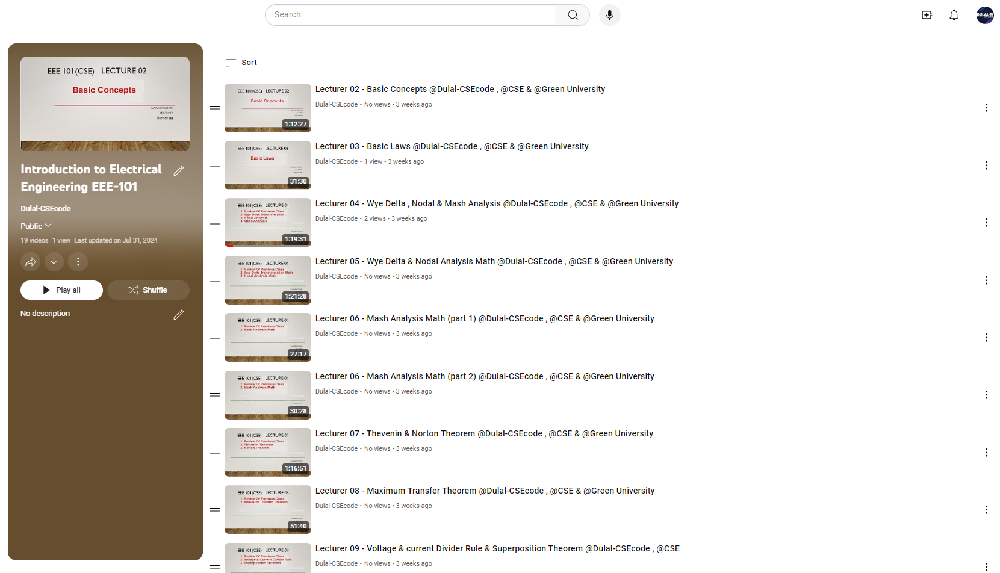

<h1 align="center">--- Introduction-to-Electrical-Engineering-EEE-101 ---</h1>  
<h3 align="center">-- Fall 2022 --</h3>  
<br />  
Welcome to the Introduction to Electrical Engineering EEE-101 repository. This repository contains course materials, assignments, and resources for the Introduction to Electrical Engineering course.  
<br />  



  
<br />  

## Table of Contents
- [Introduction](#introduction)
- [Course Outline](#course-outline)
- [Installation](#installation)
- [Prerequisites](#prerequisites)
- [Assignments and Practice Problems](#assignments-and-practice-problems)
- [Usage](#usage)
- [Contributing](#contributing)
- [License](#license)

## Introduction

This course covers the fundamental concepts of electrical engineering, including basic quantities, circuit elements, Ohm's Law, Kirchhoff's Laws, circuit analysis techniques, and more. The repository provides a comprehensive guide to understanding and applying these principles through problem-solving and practical applications.

Check out the playlist now and start your learning journey: [Introduction to Electrical Engineering EEE-101 Youtube Playlist Link : ](https://youtube.com/playlist?list=PLEc-WcPXUsjuHYFOPzV8Jcwsrvs4kamBE&si=qcZqL-PLgnxL1H7j)
**Happy Learning!**

## Course Outline

### 1. Introduction to the Course and Other Particulars
- Overview of course objectives and structure.
- Introduction to electrical engineering concepts.

### 2. Basic Quantities, Circuit Elements
- **Text:** 1.1-1.6
  - Understanding basic electrical quantities and circuit elements.

### 3. Ohm’s Law, Nodes, Branches, and Loops
- **Text:** 2.2-2.3
  - Applying Ohm's Law and analyzing nodes, branches, and loops.

### 4. Kirchhoff’s Laws
- **Text:** 2.4
  - Kirchhoff's Voltage and Current Laws with problem-solving examples.

### 5. Series Resistors and Voltage Divisions, Parallel Resistors & Current Divisions
- **Text:** 2.5-2.6
  - Analyzing series and parallel resistor networks.

### 6. Finding Equivalent Resistance, Wye-Delta Transformations
- **Text:** 2.6-2.7
  - Techniques for finding equivalent resistance and applying Wye-Delta transformations.

### 7-8. Nodal and Mesh Analysis
- **Text:** 3.2-3.5
  - Systematic methods for analyzing circuits using nodal and mesh analysis.

### 9. Linearity Property, Superposition Theorem
- **Text:** 4.2-4.3
  - Understanding the linearity property and superposition theorem.

### 10. Source Transformation, Thevenin’s and Norton’s Theorem
- **Text:** 4.4-4.6
  - Applying source transformation, Thevenin’s, and Norton’s theorems.

### 11. Maximum Power Transfer Theorem, Capacitors, Series & Parallel Capacitors
- **Text:** 4.8
  - Exploring the maximum power transfer theorem and capacitor networks.

### 12. Review of Midterm Syllabus
- **Preparation for Midterm Exam**

### 13-17. Capacitors and Inductors
- **Text:** 6.1-6.5
  - Understanding capacitors, inductors, and their series-parallel combinations.

### 18-19. Introduction to First Order Circuits
- **Text:** 7.2-7.4
  - Analyzing first-order circuits and problem-solving techniques.

### 20-22. Series-Parallel Combinations, Sinusoidal Steady-State Power Calculations, RMS Values, Real and Reactive Power
- **Text:** 12.1-12.3
  - Advanced topics in circuit analysis including power calculations.

### 23. Magnetically Coupled Circuits, Series and Parallel Resonance, and Q Factors
- **Text:** 12.4-12.8
  - Exploring magnetically coupled circuits and resonance phenomena.

### 24. Review of Final Syllabus
- **Preparation for Final Exam**

## Installation

To set up the environment:

1. Clone the repository:
   ```bash
   git clone https://github.com/Dulal-CSEcode/Introduction-to-Electrical-Engineering-EEE-101.git
   cd Introduction-to-Electrical-Engineering-EEE-101
2. Install any required packages or dependencies. For example, on a Debian-based system:

    ```bash
    sudo apt-get update
    sudo apt-get install build-essential
    ```

## Prerequisites

Before you begin, ensure you have met the following requirements:

- You have a basic understanding of accounting principles.
- You have access to a text editor.
- You have installed Git on your computer.

## Assignments and Practice Problems

This repository includes a collection of assignments and practice problems to help reinforce the concepts taught in the course. Each assignment is located in its respective directory with detailed instructions and resources.

## Usage

Navigate to the specific topic or assignment directory and follow the instructions provided in the README.md file located in each folder.

## Contributing
Contributions are welcome! To contribute, please follow these steps:

1. Fork the repository.

2. Create a new branch (e.g., feature-branch).

3. Make your changes and commit them (git commit -m 'Add new feature').

4. Push to the branch (git push origin feature-branch).

5. Create a pull request.

Please ensure your code follows the repository's coding standards and includes appropriate tests.

## License
This project is licensed under the MIT License. See the LICENSE file for more details.

<br/>
<h2 align="center"> Thanks for visiting the Introduction-to-Electrical-Engineering-EEE-101 repository.</h2>
<h3 align="center">© All rights reserved by Dulal-CSEcode @2024 © Department of Computer Science and Engineering, GUB </h3>
